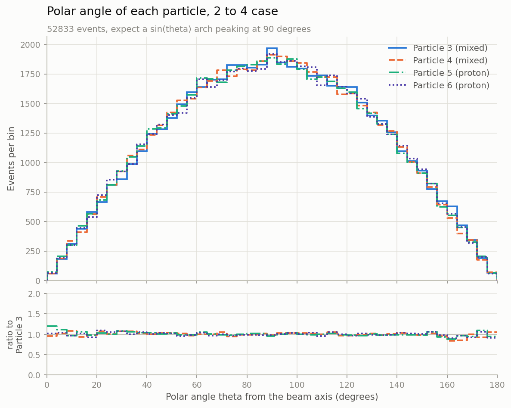
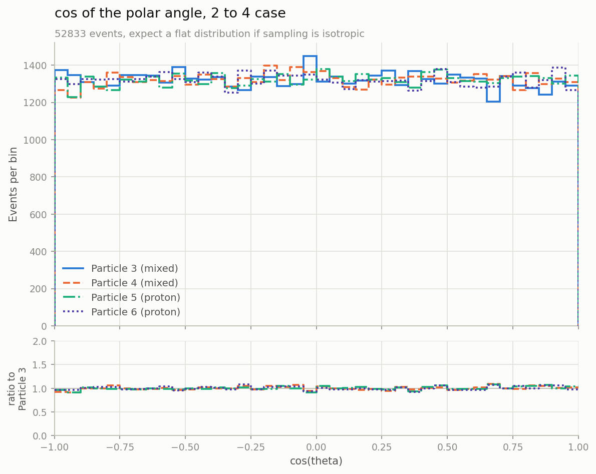

# LHC Simplified Particle Collision Simulator

A simplified Monte Carlo simulation of proton–proton collisions at the Large Hadron
Collider (LHC), written in Python. It "collides" two protons over and over,
invents a physically valid set of outgoing particles for each collision, filters
them through a simplified detector, and saves the survivors to a text file that
we then turn into histograms.

This README is written for someone who has **never seen the code or the physics
before**. It starts from the physics ideas, then shows how each idea turns into
code, and finally how to run everything.

The simulation now works in **full 3D**. Earlier versions kept everything in a
flat plane to make the maths easier, so wherever that move changed something
important, this README says so.


*Energy carried by each of the four particles produced in a 2 to 4 collision,
over 52,833 events. Every figure in this project is drawn as an outline rather
than a filled histogram, so all the particles in a channel can share one set of
axes. The panel underneath shows each curve divided by the first. Particles 3 and
4 clearly drift towards higher energies than 5 and 6, which is a real asymmetry
in how we generate events — see [section 7](#7-known-limitations-and-things-still-to-fix).*

---

## Table of contents

1. [The physics, from scratch](#1-the-physics-from-scratch)
2. [How the code mirrors the physics](#2-how-the-code-mirrors-the-physics)
3. [How to run it](#3-how-to-run-it)
4. [The output file explained](#4-the-output-file-explained)
5. [Making the plots](#5-making-the-plots)
6. [What the plots should look like](#6-what-the-plots-should-look-like)
7. [Known limitations and things still to fix](#7-known-limitations-and-things-still-to-fix)
8. [Project structure](#8-project-structure)

---

## 1. The physics, from scratch

Read this section first. If you understand it, the code in section 2 will feel
like a straight translation of these ideas.

### 1.1 What is actually being simulated?

The LHC is a 27 km ring that accelerates two beams of **protons** in opposite
directions and smashes them head-on. Each beam carries **6.8 TeV** of energy, so
a head-on collision has a total energy of **13.6 TeV** — the real LHC "Run 3"
energy.

- **TeV** means tera-electronvolt, a unit of energy. Everything in this project
  is measured in TeV.
- A **proton** is not fundamental. It is a bag of smaller pieces (quarks and
  gluons, collectively "partons"). When two protons collide it is really one
  piece from each proton that interacts hard, while the leftovers carry on.

When the collision happens the energy is briefly concentrated into a tiny point
and then re-materialises as **new particles**. Which particles come out is random
and governed by probabilities.

### 1.2 What comes out of a collision? (the "final state")

The list of particles produced by one collision is called the **final state**.
We use a fixed menu of possible final states, each with a fixed probability:

| Probability | Final state                             | Particles |
|-------------|-----------------------------------------|-----------|
| 25%         | proton + proton                         | 2 |
| 22%         | photon + proton + proton                | 3 |
| 18%         | neutron + antineutron + proton + proton | 4 |
| 15%         | positron + electron + proton + proton   | 4 |
| 15%         | muon + antimuon + proton + proton       | 4 |
| 5%          | photon + photon + proton + proton       | 4 |

Most cases also produce "proton remnants", the leftovers of the original protons
that did not interact, alongside the interesting particles from the hard
collision.

The most physically interesting case is the **two-photon** one, because two
photons are how a **Higgs boson** reveals itself. We made it deliberately rare at
5%, just as a real Higgs signal is rare.

Notice that the menu only ever produces 2, 3, or 4 particles. That is what the
code calls the **2 to 2**, **2 to 3**, and **2 to 4** channels, and it is the
organising idea behind almost everything else in the project.

### 1.3 The two rules nature never breaks

Whatever comes out, two quantities must be **conserved**, meaning identical
before and after the collision:

1. **Energy.** The outgoing particles' energies must add up to the total we
   started with, **13.6 TeV**.
2. **Momentum.** Momentum is "quantity of motion" and it has a direction. The two
   protons come in exactly head-on with equal and opposite momentum, so the total
   momentum before the collision is **zero**. The outgoing particles' momenta must
   therefore also add up to **zero**, flying out in balanced directions like the
   fragments of an explosion.

Every event this simulation produces obeys both rules exactly. That is the single
most important correctness property of the whole program, and `simulation.py`
re-checks it on every event rather than taking it on trust.

### 1.4 Describing one particle: the four-vector

We place the collision at the origin with the **beam running along the `z`
axis**. The `x` and `y` axes point sideways, across the beam.

Each particle is then described by four numbers bundled together, called a
**four-vector**:

```
(E, px, py, pz)  =  (energy, momentum along x, along y, along z)
```

> **This is where 3D changed things.** The old 2D version had only `(E, px, pz)`,
> because everything was confined to one flat plane containing the beam. Adding
> `py` lets particles fly anywhere in space, which is what really happens.

Two derived quantities matter:

- **Momentum magnitude**, `|p| = sqrt(px² + py² + pz²)`, is how much motion the
  particle has if we ignore direction.
- **The direction it flew**, which in 3D needs *two* angles rather than one.

### 1.5 The two angles

In a plane, one angle is enough to say which way something went. In space you
need two, and they are worth getting straight because every angle plot in this
project uses them.

```
        θ = 0°   straight down the beam, forward
           ↑
           │ z  (beam axis)
           │        ╱ particle
           │      ╱
           │ θ  ╱
           │  ╱
   ────────●────────  θ = 90°   straight out the side
          ╱ collision
        ╱
      ╱
     ↓
  θ = 180°   straight back up the beam
```

- **Polar angle θ (theta)** is measured away from the beam axis. It answers "how
  far off the beam line did it go?" and runs from 0° to 180°. That range is
  enough, because 180° already points backwards.
- **Azimuthal angle φ (phi)** is the rotation *around* the beam. Picture looking
  straight down the beam pipe at a clock face: φ is the clock position. It runs
  from 0° to 360°.

In code these come straight out of the momentum components:

```python
theta = math.acos(pz / |p|)      # how much of the momentum lies along the beam
phi   = math.atan2(py, px)       # which way it points in the x-y plane
```

θ is the physically meaningful one. A real detector has a hole where the beam
pipe passes through, so particles at very small θ escape unseen. Nothing similar
happens in φ, because a detector is built symmetrically around the beam and no
clock position is special.

### 1.6 Why θ is not evenly spread

This surprises people, so it is worth its own heading.

We throw particles in **completely random directions**, with no preference
whatsoever. Even so, the θ histogram is *not* flat. It is an arch peaking at 90°.

The reason is geometry, not physics. Think of latitude lines on a globe. The band
between 89° and 90° latitude is a tiny cap at the pole. The band between 0° and
1°, the same one degree of angle, wraps the entire equator and has vastly more
area. A sphere simply has more room near its equator than near its poles, so more
particles land there.

The amount of room scales as **sin θ**, which is exactly the shape you see in the
θ plots. Taking the cosine cancels the effect precisely, so **cos θ comes out
flat**. That makes cos θ the honest test of whether our random directions really
are random, and it is why the project plots it alongside θ.

Here is the same data plotted both ways:

<table>
<tr>
<td width="50%"></td>
<td width="50%"></td>
</tr>
<tr>
<td><em>θ arches up towards 90°, because a sphere has more room near its equator.</em></td>
<td><em>cos θ is flat, which is what "no preferred direction" actually looks like.</em></td>
</tr>
</table>

Nothing about the physics differs between those two pictures. They are the same
particles, plotted through a different lens.

> If a θ histogram ever comes out flat, something is broken. If a cos θ histogram
> comes out anything other than flat, something is broken.

### 1.7 Mass, and the most important formula: invariant mass

Einstein's relation ties a particle's energy, momentum, and mass together:

```
E² = |p|² + m²           (in units where the speed of light is 1)
```

So a particle's **mass** can be recovered from its four-vector:

```
m = sqrt(E² − px² − py² − pz²)
```

This is the **invariant mass**. "Invariant" means every observer agrees on it no
matter how fast they are moving, which makes it the perfect tool for identifying
particles.

The magic trick is that you can compute the invariant mass of **several particles
added together**, treating them as a single object:

```
m(group) = sqrt( (ΣE)² − (Σpx)² − (Σpy)² − (Σpz)² )
```

**Why we care:** if two photons came from a decaying Higgs boson, the invariant
mass of those two photons always equals the **Higgs mass, 125 GeV (0.125 TeV)**.
Make a histogram of the two-photon invariant mass over many events and a Higgs
shows up as a bump at 125 GeV sitting on a smooth background. That is exactly how
the Higgs was found in 2012.

*This version does not inject a Higgs bump — see [section 7](#7-known-limitations-and-things-still-to-fix).*

### 1.8 How we build one event: split two at a time

Here is the idea (report section 2.5.3) that lets us create any final state while
**guaranteeing** energy and momentum conservation.

Rather than trying to place 3 or 4 particles at once, we only ever split **one
thing into two**, because a two-body split is easy to make conservation-perfect:

> If a parent particle sits still and splits into two, the children must fly off
> in **exactly opposite directions** with **equal and opposite momentum**, and
> energy conservation fixes exactly how much energy each child gets.

To build a 4-particle final state, say two photons and two protons:

1. Pretend the two photons are secretly **one** made-up particle, call it `(34)`,
   and the two protons another, `(56)`. Each made-up particle gets an invariant
   mass that we pick at random.
2. Split the whole collision into `(34)` + `(56)`, one clean two-body split.
3. Split `(34)` into its two photons and `(56)` into its two protons, two more
   two-body splits.

There is one complication. When we split `(34)` we work in the frame where `(34)`
is standing still, but `(34)` is really **flying through the lab**. So we have to
**boost** its two children, a Lorentz transformation that accounts for that
motion. This is standard special relativity (report section 2.5.4).

> **3D again.** The boost used to be a 3×3 matrix acting on `(E, px, pz)`. It is
> now the general 4×4 Lorentz boost acting on `(E, px, py, pz)`. Same idea, one
> more dimension.

A 3-particle final state works the same way with a single composite. A 2-particle
final state is one split with no boost needed at all.

The upshot is that every particle comes out **on-shell**, meaning its `E`, `p`,
and `m` are mutually consistent, and the whole event conserves energy and
momentum automatically.

### 1.9 The detector: what we can actually see

A real detector cannot see everything, so we model two blind spots with **cuts**.
An event is kept only if **every** particle in it passes both:

1. **Energy cut** — the particle must carry at least `MIN_ENERGY`. Very soft
   particles are lost in the noise.
2. **Angle cut** — the particle's polar angle θ must fall inside
   `VISIBLE_THETA_DEG`. Angles near 0° and 180° point straight down the beam pipe,
   where a real detector has no coverage.

> **Both cuts are currently switched off**, at `MIN_ENERGY = 0.00` and
> `VISIBLE_THETA_DEG = (0, 180)`, which accepts everything. The machinery is all
> there and turning it back on is a two-line edit at the top of `simulation.py`.
> Just be aware that as things stand, accepted events equal total collisions.

Note that the cut is on θ and not φ, which is the physically correct choice: the
beam pipe is a hole along the beam axis, so it removes a cone at small θ, not a
wedge in φ.

---

## 2. How the code mirrors the physics

The project splits into two layers. The **simulation** layer produces events, and
the **analysis** layer reads them back and plots them. They meet at one file,
`events.txt`, and are otherwise independent.

```
                                    ┌────────────── analysis_tools/ ──────────────┐
simulation.py ──writes──► collision_data/events.txt ──► event_data.py ──► step_plot.py ──► plots/
```

### 2.1 The simulation layer

| File | Plays the role of | Responsible for |
|------|-------------------|-----------------|
| `utilities/kinematics.py` | the **physicist** | the physics: four-vectors, two-body splits, boosts, invariant mass (sections 1.4–1.8). Deals only in numbers, never particle names. |
| `simulation.py` | the **director** | running the experiment: choosing final states, applying detector cuts, writing the output (sections 1.2, 1.3, 1.9). |

**`kinematics.py`** is organised in five numbered sections, in reading order:

1. **The four-vector.** `P4 = (E, px, py, pz)`, plus `mass(p4)` and
   `invariant_mass(*p4s)` — a direct translation of sections 1.4 and 1.7.
2. **The two building blocks.** `two_body_decay(parent_mass, m1, m2)` splits a
   parent-at-rest into two children; `boost(p4, parent_p4)` carries a child from
   its parent's rest frame into the lab; `decay_in_lab(...)` is a small helper
   that does "decay, then boost both children" so the generators below do not
   repeat themselves.
3. **`draw_composite_mass(low, high)`** randomly picks the invariant mass of a
   made-up composite like `(34)`.
4. **The generators**, one per final-state size, named after the report's cases:
   `two_to_two`, `two_to_three`, `two_to_four`. Each is just the building blocks
   arranged as described in section 1.8. Every *final* particle is treated as
   **massless**; only the intermediate composites carry mass.
5. **`generate_momenta(n_particles, total_energy)`** is the single entry point.
   Because every particle is massless it only needs to know *how many* there are.

`kinematics.py` never mentions "photon" or "proton". It only sees masses and
numbers, which keeps the physics reusable and testable on its own.

**`simulation.py`** reads top to bottom as five steps:

1. **`choose_final_state()`** rolls a random number and returns the list of
   particle **names** for this collision, from the menu in section 1.2.
2. **`make_event(names)`** is the bridge to the physics. It calls
   `kinematics.generate_momenta(...)`, works out θ and φ for each result, and
   packages everything into `Particle` objects carrying
   `(name, energy, px, py, pz, theta, phi)`.
3. **The detector**: `is_seen(particle)` applies the energy and θ cuts,
   `passes_cuts(event)` keeps the event only if every particle is seen, and
   `is_conserved(event)` re-checks that energy sums to 13.6 and momentum sums to
   zero.
4. **`write_event(...)`** appends one accepted event to the output file.
5. **`run_simulation()` / `main()`** loop until enough good events are logged,
   then print a short summary.

### 2.2 The analysis layer

| File | What it does |
|------|--------------|
| `event_data.py` | Reads `events.txt` once and hands back tidy arrays, grouped by channel. |
| `step_plot.py` | Draws histograms as outlines instead of filled bars, so several can share one set of axes. |
| `graph_energy_steps.py` | Energy of every particle. |
| `graph_angle_steps.py` | θ, φ, and cos θ of every particle. |
| `graph_mass_steps.py` | Single-particle and pair invariant masses. |

`event_data.py` exists because of a lesson we learned the hard way. The graphing
scripts we used before the 3D move each carried their own copy of the file parser
with a **column number** hard-coded into it. When the output gained `Phi` and
`p_y`, those numbers silently pointed at the wrong columns. Nothing crashed; the
plots just quietly became wrong. Reading the file in one place, and naming
columns instead of numbering them, is what stops that happening again.

Everything in `analysis_tools/` works out its paths from its own location rather
than from the working directory, so the scripts behave identically whether you
run them from the project root, from inside `analysis_tools/`, or from the VS
Code Run button. Figures always land in `plots/` at the project root.

`step_plot.py` is a library, not a script. Running it directly does nothing at
all — it only acts when one of the three `graph_*` scripts imports it.

### 2.3 The data flow, end to end

```
 simulation.py                          utilities/kinematics.py
 ─────────────                          ───────────────────────
 choose_final_state()
   → ["photon","photon","proton","proton"]   (just names, no physics yet)
        │
   count them  → 4 particles
        │
   make_event()  ── generate_momenta(4, 13.6) ──►  pick generator (two_to_four)
                                                     split into composites,
                                                     decay each, boost
        ◄────────────  [P4, P4, P4, P4]  ────────────
        │
   work out θ and φ, wrap each P4 + name  →  [Particle × 4]
        │
   is_conserved? ✓   passes_cuts? ✓
        │
   write_event()  →  append to collision_data/events.txt
        │
   repeat until 100,000 events are logged
```

**In one sentence:** `simulation.py` decides *which* particles appear and judges
the result, while `kinematics.py` produces the *actual energies and momenta*,
obeying the conservation laws by construction.

---

## 3. How to run it

### 3.1 What you need

- **Python 3** (developed on 3.14).
- **numpy** and **matplotlib**, for the analysis scripts only. The simulation
  itself uses nothing outside the standard library.

The repository ships a virtual environment in `.venv/`. Note that it uses a
`bin/` layout rather than the usual Windows `Scripts/`:

```powershell
.\.venv\bin\Activate.ps1        # then plain `python` works
```

Or call it directly without activating:

```powershell
.\.venv\bin\python.exe analysis_tools\graph_energy_steps.py
```

If you are setting up fresh instead:

```
python -m venv .venv
pip install numpy matplotlib
```

In VS Code, check the interpreter shown in the bottom-right corner is the one in
`.venv`. If it is pointing at a system Python, numpy and matplotlib will not be
found.

### 3.2 Run the analysis

**`collision_data/events.txt` already contains 100,000 events**, so you can go
straight to the plots without generating anything. Start here:

```powershell
python analysis_tools\event_data.py       # ~2s — prints a summary, writes nothing
```

It prints each channel followed by a line per particle slot:

```
2 to 2: 24985 events
    slot 0 (particle 3): mean E =  6.8000 TeV   names = proton
    slot 1 (particle 4): mean E =  6.8000 TeV   names = proton
2 to 3: 22182 events
    slot 0 (particle 3): mean E =  4.5365 TeV   names = photon
    ...
2 to 4: 52833 events
    ...
```

That is a good first check. If the three event counts look right, the file parsed
cleanly and the rest will work. Then run any or all of:

```powershell
python analysis_tools\graph_energy_steps.py    # ~3s
python analysis_tools\graph_angle_steps.py     # ~4s
python analysis_tools\graph_mass_steps.py      # ~4s
```

Each writes PNGs into `plots/` and prints a table of the same numbers it drew, so
the values are available without opening an image. The three are independent and
can be run in any order, from any working directory.

### 3.3 Re-run the simulation

Only needed if you have changed the physics:

```powershell
python simulation.py            # ~5s
```

> **Careful.** This opens `collision_data/events.txt` in write mode and **overwrites it without
> asking**. Copy the file first if you want to compare before and after. It is
> also tracked in git at 48 MB, so re-running puts a very large diff in your
> working tree.

Afterwards, re-run the three graph scripts to refresh the figures.

You can change the behaviour from the settings at the top of `simulation.py`:

| Setting | Default | What it does |
|---|---|---|
| `TOTAL_ENERGY` | `13.6` | Collision energy in TeV |
| `TARGET_LOGGED_EVENTS` | `100000` | How many accepted events to collect |
| `MIN_ENERGY` | `0.00` | Energy cut (currently disabled) |
| `VISIBLE_THETA_DEG` | `(0, 180)` | Polar angle window (currently accepts everything) |
| `OUTPUT_FILE` | `collision_data/events.txt` | Where to write |

---

## 4. The output file explained

`collision_data/events.txt` holds one block per accepted event:

```
___EVENT_ID: 1___
N_Particles: 2
Particle       Energy(TeV)    Theta(deg)     Phi(deg)       p_x(TeV)       p_y(TeV)       p_z(TeV)
proton         6.800000       66.421353      79.170650      1.170949       6.121291       2.720051
proton         6.800000       113.578647     259.170650     -1.170949      -6.121291      -2.720051

___EVENT_ID: 2___
N_Particles: 4
...
```

- `___EVENT_ID: n___` is the event number.
- `N_Particles` is how many particles this event has: 2, 3, or 4.
- Then one row per particle giving its **name**, **energy** in TeV, the two
  **angles** in degrees, and the three **momentum components** in TeV.

You can sanity-check any event by hand. The energies add up to 13.6, and the
`p_x`, `p_y`, and `p_z` columns each add up to about zero.

> **The row layout changed when we moved to 3D.** It used to be
> `name, Energy, Angle(rad), p_x, p_z` — five columns with the angle in radians.
> It is now seven columns with both angles in degrees. Anything written against
> the old five-column layout needs updating before it will read this file
> correctly.

One practical consequence worth knowing: values are written with **six decimal
places**. At 13.6 TeV that rounding works out to a few GeV of uncertainty once it
passes through `m = sqrt(E² − p²)`, which sets a floor on how sharp any
reconstructed mass peak in this file can be.

---

## 5. Making the plots

All three analysis scripts draw histograms **as outlines** rather than filled
bars. A filled histogram hides whatever is behind it, so you can only look at one
particle at a time — which is why the old scripts wrote a separate image per
particle and you had to flick between them. Drawing just the line along the tops
of the bars lets every particle in a channel share one set of axes.

Each figure also carries a **ratio panel** underneath, showing each curve divided
by the first one. A line sitting flat on 1.0 means those two particles have the
same shape.

Running the three scripts produces **20 figures** in `plots/`:

| Script | Figures | Contents |
|---|---|---|
| `graph_energy_steps.py` | 3 | Energy, one figure per channel |
| `graph_angle_steps.py` | 9 | θ, φ, and cos θ, per channel |
| `graph_mass_steps.py` | 8 | Single-particle mass, pair masses, diphoton mass |

### A note on "the mass of each particle"

`kinematics.py` treats every outgoing particle as massless, so a single
particle's mass is zero by construction in every channel. Plotting it tells you
nothing about physics — but we plot it anyway, because it tells you something
useful about the data: whatever width that spike has is pure numerical noise, and
it is the sharpest any other mass peak in the file could possibly be.

The masses that actually carry information belong to **groups** of particles. Two
massless photons flying apart have a real, heavy combined mass. That is what the
composites of section 1.8 are, and what a real detector reconstructs when hunting
a Higgs. So the rest of `graph_mass_steps.py` plots the invariant mass of every
pair.


*Why pairing matters. In a 2 to 3 collision, particles 4 and 5 genuinely came out
of one composite, so the mass of pair 45 is flat — it is simply the distribution
we drew from. Pairs 34 and 35 were never a single object, so they give the broad
hump instead. A real analysis faces exactly this problem: the interesting pairing
sits on top of a background of wrong pairings, and telling them apart is the
whole game.*

---

## 6. What the plots should look like

The useful thing about these distributions is that most of them have a shape you
can check against, which makes them a test of the simulation and not just a
picture of it.

| Figure | Expected shape | What it tells you |
|---|---|---|
| `costheta_steps_*` | **Flat** | The direct test that our random directions are genuinely isotropic. Check this one first. |
| `theta_steps_*` | **sin θ arch** peaking at 90° | Section 1.6. Flat here would mean the 3D sampling is broken. |
| `phi_steps_*` | **Flat** | No preferred direction around the beam. |
| `energy_steps_2particles` | A single spike at 6.8 TeV | With two massless particles and nothing else, conservation leaves no freedom at all. Both curves land on top of each other. |
| `energy_steps_4particles` | Particles 3 and 4 rising, 5 and 6 falling | The generator asymmetry described in section 7. |
| `mass_single_steps_*` | A spike at zero | Every particle is massless, so the width is file rounding, not physics. |
| `mass_pairs_steps_3particles` | Pair 45 **flat**, pairs 34 and 35 humped | Pair 45 really was a composite, so its mass is the flat distribution we drew. The other two were never a single object, so they show the combinatorial background shape. |
| `mass_pairs_composites_4particles` | Pair 34 flat, Pair 56 falling away | The clearest view of the generator asymmetry. |

---

## 7. Known limitations and things still to fix

These are honest caveats rather than bugs that break the run.

1. **Every particle is treated as massless.** A deliberate simplification: final
   particles get no rest mass, so the `MASS` table in `simulation.py` is kept for
   reference only. It is a good approximation because all these masses are tiny
   next to 13.6 TeV, but it does mean a reconstructed proton comes out at ~0
   rather than its real 0.938 GeV. The intermediate composites still carry mass,
   and that part is essential and unaffected.

2. **No Higgs bump.** The two-photon invariant mass is a plain random spread with
   no 125 GeV peak. Adding one means drawing the `(34)` composite mass from a
   narrow Gaussian at 0.125 TeV for some fraction of events.

3. **Energy sharing is random rather than physical.** Composite masses are drawn
   uniformly, not from real particle-physics probabilities (matrix elements), so
   the distributions are illustrative and not predictive.

4. **The 2 to 4 channel is lopsided.** We draw `m34` uniformly across the whole
   range, then draw `m56` from whatever is left over. The second window is
   therefore smaller on average, so the `(56)` composite is systematically
   lighter and its particles systematically softer. Measured over 52,833 events,
   particles 3 and 4 average 4.17 TeV while particles 5 and 6 average only 2.65
   TeV, when by symmetry they ought to match. Fixing it means drawing both
   masses jointly instead of one after the other.

5. **Six decimal places limits mass resolution.** As noted in section 4, the
   output format caps reconstructed invariant mass precision at a few GeV. That
   is fine for TeV-scale composites but would matter for a 125 GeV peak.

6. **The detector cuts are switched off.** See section 1.9.

7. **`collision_data/events.txt` is 48 MB and tracked in git.** Convenient, since the plots can
   be reproduced without re-running anything, but it makes the repository heavy.

---

## 8. Project structure

The project splits cleanly in two. The simulation lives at the top level, the
analysis lives in `analysis_tools/`, and the data file they share sits between
them in `collision_data/`. Neither half imports the other.

```
LHC Simulation/
├── simulation.py               the experiment — run this to regenerate events
│
├── utilities/
│   └── kinematics.py           the physics engine
│
├── analysis_tools/
│   ├── event_data.py           reads events.txt into tidy arrays
│   ├── step_plot.py            outline-histogram drawing (a library, not a script)
│   ├── graph_energy_steps.py   ┐
│   ├── graph_angle_steps.py    ├─ the three analysis scripts
│   └── graph_mass_steps.py     ┘
│
├── collision_data/
│   └── events.txt              100,000 simulated events (the current dataset)
│
└── plots/                      the 20 figures the analysis scripts produce
```

Every script works out these paths from its own location rather than from the
working directory, so they behave the same wherever you launch them from.

### What each file does

| File | What it is |
|------|------------|
| `utilities/kinematics.py` | The physics engine: four-vectors, two-body decays, Lorentz boosts, invariant mass. Knows nothing about particle names. |
| `simulation.py` | Runs the experiment: chooses final states, applies detector cuts, writes `collision_data/events.txt`. |
| `analysis_tools/event_data.py` | Parses `events.txt` and groups events by channel. Run it on its own for a quick summary of the dataset. |
| `analysis_tools/step_plot.py` | Turns bin counts into outline curves and lays out the figure, including the ratio panel. Imported by the three scripts below, and does nothing if you run it directly. |
| `analysis_tools/graph_energy_steps.py` | Energy of each particle, one figure per channel. |
| `analysis_tools/graph_angle_steps.py` | θ, φ, and cos θ of each particle, per channel. |
| `analysis_tools/graph_mass_steps.py` | Single-particle mass, pair invariant masses, and the diphoton mass. |
| `collision_data/events.txt` | The current dataset: 100,000 events in the 3D seven-column format. |

---

*Phenikaa University Research Lab — computational physics simulation of
high-energy proton collisions.*
